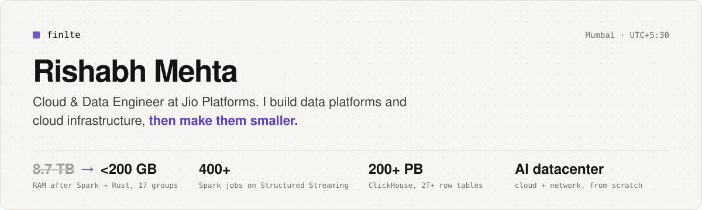
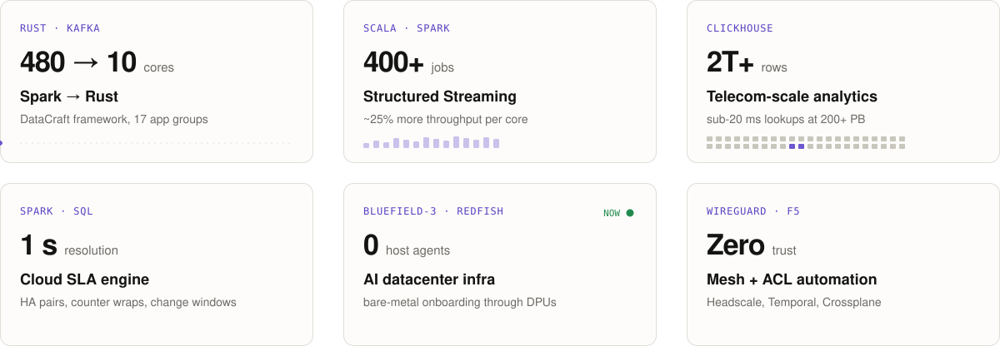
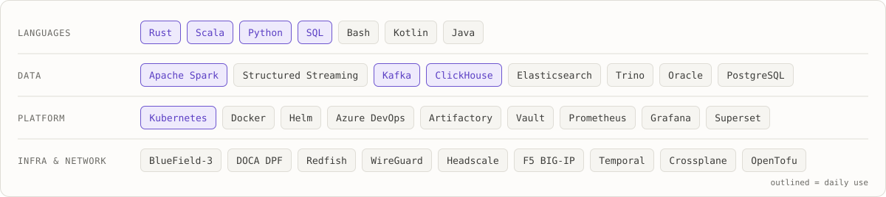

<a href="https://fin1te.com">
  <picture>
    <source media="(prefers-color-scheme: dark)" srcset="assets/banner-dark.svg" />
    
  </picture>
</a>

 

Hi, I'm Rishabh. I work on the **Jio Cloud** team at Jio Platforms in Mumbai, mostly on the kind of infrastructure nobody notices until it breaks: data platforms, streaming pipelines, analytics at telecom scale, and lately the cloud and network layer of an AI datacenter.

> [!NOTE]
> **Right now:** building cloud infrastructure and networking for **India's largest AI datacenter**, from the ground up. BlueField-3 DPUs provisioned out-of-band, a private WireGuard mesh into GPU pods, and workflow-driven firewall automation.

## Selected work

<a href="https://fin1te.com/work">
  <picture>
    <source media="(prefers-color-scheme: dark)" srcset="assets/work-dark.svg" />
    
  </picture>
</a>

This work is internal, so the code isn't public. <a href="https://fin1te.com">fin1te.com</a> has high-level write-ups and simplified, generalised diagrams; anything sensitive is left out.

## Writing

<table>
  <tr>
    <td width="110"><code>Aug 2026</code></td>
    <td><a href="https://fin1te.com/writing/dstream-to-structured-streaming"><b>Moving 400+ Spark jobs from DStreams to Structured Streaming</b></a> A naive port was twice as slow and quietly lost data. Nine fixes later, it pulled ahead.</td>
  </tr>
  <tr>
    <td width="110"><code>Aug 2026</code></td>
    <td><a href="https://fin1te.com/writing/a-spark-ui-for-structured-streaming"><b>Building the Spark UI that Structured Streaming should have had</b></a> A SparkPlugin, a query listener and server-rendered SVG, for real Kafka lag in minutes.</td>
  </tr>
  <tr>
    <td width="110"><code>Apr 2026</code></td>
    <td><a href="https://fin1te.com/writing/spark-to-rust"><b>Replacing a 480-core Spark job with 10 cores of Rust</b></a> Parity on live traffic, and the thread-count bug that nearly derailed it.</td>
  </tr>
  <tr>
    <td width="110"><code>Mar 2026</code></td>
    <td><a href="https://fin1te.com/writing/clickhouse-sort-keys"><b>Sub-20 ms lookups on trillion-row tables</b></a> ClickHouse sort keys, granules, and why a point lookup should not care how big the table is.</td>
  </tr>
  <tr>
    <td width="110"><code>Nov 2025</code></td>
    <td><a href="https://fin1te.com/writing/the-497-day-bug"><b>The 497-day bug</b></a> Healthy switches showing up as down, and the 32-bit counter behind it.</td>
  </tr>
  <tr>
    <td width="110"><code>Sep 2025</code></td>
    <td><a href="https://fin1te.com/writing/how-cloud-slas-are-calculated"><b>How a cloud SLA is actually calculated</b></a> HA pairs, silent outages, change windows: deciding which seconds of downtime count.</td>
  </tr>
</table>

## Stack

<a href="https://fin1te.com/stack">
  <picture>
    <source media="(prefers-color-scheme: dark)" srcset="assets/stack-dark.svg" />
    
  </picture>
</a>

## Before Jio

- `2023` &nbsp; B.E. Computer Engineering, **9.3 CGPA**, Best Performer of the batch
- `2023` &nbsp; Lead organiser of **HackOverflow**, a national hackathon, and [built its Android app](https://github.com/fin1te/HackOverflow-Android)
- `2021–22` &nbsp; **Google Developer Student Clubs Lead**, selected by Google India
- `2022` &nbsp; Project admin at **GirlScript Summer of Code**, Google Android Educator, Postman Student Expert
- `2020–23` &nbsp; Android apps in Kotlin and Java, most of the older repos on this profile

## Elsewhere

